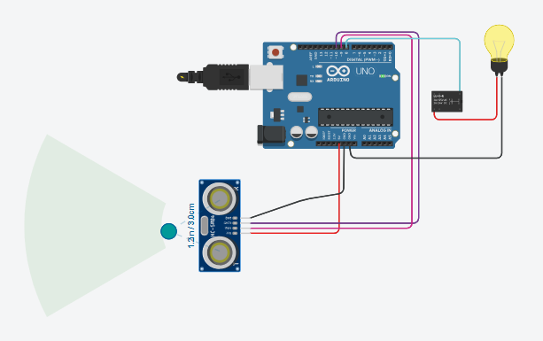

# Projeto Sensor de Proximidade + Lâmpada

## Descrição
Controle de relé (com lâmpada) via sensor ultrassônico, que ativa a lâmpada após detectar objeto até 10cm de distância.

## Grupo
 - [Bernardo Alexandre Alves Rodrigues](mailto:bernardorodrigues@usp.br)
 - [Gabriel Phelippe Prado](mailto:gabriel.phelippe@usp.br)
 - [Gabriel Campanelli Iamato](mailto:gabriel.c.iamato@usp.br)
 - [Henrique Vieira Lima](mailto:vieira.henrique@usp.br)

## Informações
 - **Disciplina:** Eletrônica para Computação
 - **Professor:** Eduardo do Valle Simões
 - **Curso:** Bacharelado em Ciência da Computação
 - **Turma:** BCC-A / 2024 

## Projeto
 - Assista ao funcionamento do projeto pelo [vídeo](add link dentro do parêntese)

## Lista de Componentes
| Quantidade | Componentes             | Valor (R$) |
|-----|------------------------------|-|
| 1x  | Sensor Ultrassônico HC-SR04    | R$9,20  |
| 1x  | Relé 5                         | R$6,30  |
| 1x  | Arduino Uno + Cabo USB 2.0     | R$69,21  |
| 1x  | Protoboard 400 pontos          | R$11,25  |
| 12x | Jumpers                        | R$26,82* |
| **Total** |                 | **R$122,78** |
- Preços baseados em na loja [Baú da Eletrônica](https://www.baudaeletronica.com.br/).
- Observação: o preço mencionado refere-se a 40 jumpers macho/fêmea (R$ 13,41) e 40 jumpers macho/macho (R$13,41).

## Funcionamento dos Componentes
 - **Sensor ultrassônico:** dispositivo que utiliza ondas sonoras de alta frequência (ultrassons) para detectar a presença, proximidade ou movimento de objetos. Nesse contexto, o sensor possui o objetivo de detectar a proximidade de algum objeto ou corpo. Por meio de cálculos, é possível saber aproximadamente a distância entre o sensor e o elemento percebido espacialmente.
 - **Relé 5V**: dispositivo eletromecânico utilizado para controlar um circuito elétrico de alta potência usando um sinal de baixa potência. Ele atua como um interruptor controlado eletricamente, de forma que, nesse circuito, quando a distância do corpo/objeto e do sensor for menor que 10 cm, o relé é acionado e a lâmpada acende. 
 - **Placa Arduino**: São placas de circuito impresso que contêm um microcontrolador, interfaces de entrada/saída (I/O) e pinos de conexão para facilitar a interação com componentes eletrônicos externos. Nesse contexto, o Arduino faz a interligação do circuito entre o sensor ultrassônico e o relé.
 - **Cabo USB 2.0**: faz a conexão entre o computador com código programado em Arduino e a placa Arduino Uno.
- **Protoboard**: placa de ensaio projetada para facilitar a montagem e teste de circuitos eletrônicos. Neste caso,em conjunto com os jumpers,ela auxilia a conectar eletricamente o circuito.
- **Jumpers**: referem-se a fios ou conectores utilizados para estabelecer conexões entre componentes eletrônicos, pinos ou pontos específicos em um circuito. Neste caso, foram utilizados jumpers do tipo macho/macho e macho/fêmea, de forma a interligar o Arduino, a protoboard, o relé e o sensor ultrassônico.

## Simulação do Circuito - TinkerCad
 - Acesse a simulação pelo [link](https://www.tinkercad.com/things/19FjRUZjI8t-surprising-jaiks-amberis/editel?sharecode=7t6YGLirJyuSfUvyjJXeBa_XiOWTuRGZKjtrNH2g5Rg)

## Licença
Esse projeto está licenciado sobre a GNU General Public License V3.0, publicada pela Free Software Foundation.
